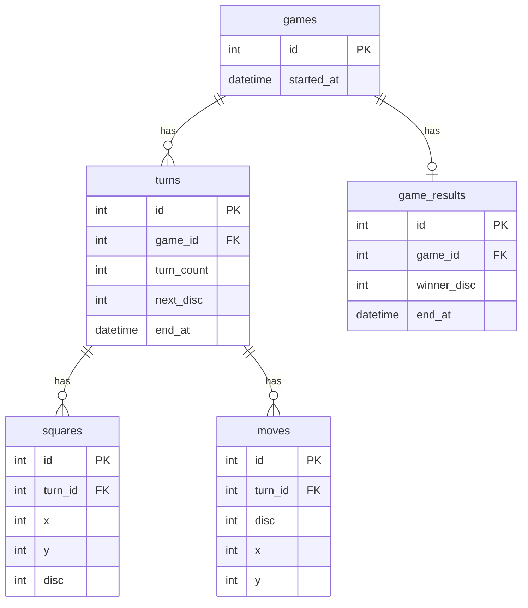

# ER図(Mermaid版)

`mysql/init.sql` のテーブル定義をもとにしたER図。元の `er.drawio` をMermaidで書き起こしたもの。

## テーブルの役割

| テーブル | 役割 |
| --- | --- |
| `games` | 対局そのもの。1対局につき1行 |
| `turns` | 手番ごとの状態。1手番につき1行 |
| `squares` | ある手番の時点での盤面64マス分のスナップショット |
| `moves` | ある手番で実際に打たれた1手の記録 |
| `game_results` | 対局が終わったときの結果 |

詳しい説明は [notes/17-ER図によるDBテーブル設計の理解.md](../notes/17-ER図によるDBテーブル設計の理解.md) を参照。
